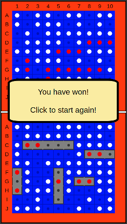

# GA Battleship
An implementation of the classic board game. Built as a project for SEIR 11-08. The game is you vs. the computer, using the classic layout with the computer screen on top and your screen on the bottom.

The game is built with extensibility in mind. A second player, or any number of additional players, could be added, without substantially modifying the code. The game board size also has the potential to be dynamic, although the capability is not fully implemented.

## Screenshots:

## Technologies Used:
- __JavaScript__
- __CSS__
- __HTML__

## Getting Started:
Play the game here: [GA Battleship](https://sdupree.github.io/ga-battleship/)

How to play: Gameplay follows the classic "Battleship" board game play. First, place your ships by clicking on your (bottom) game board. Once all five of your ships are placed, begin trynig to "sink" the Computer's ships by clicking on the Computer's (top) game board. A "miss" will result in a white peg appearing on the game board, while if you "hit" an opponent's ship a red peg will appear on the board. First player to sink the opponent's ships wins!

The game will give you messages with instructions or results. Click anywhere to close a message and continue game play.

## Next Steps:
- Refactor CSS for ships to simplify code.
- Make "game square" into a full class and encapsulate associated code, espeecially addition/subtraction.
- Add capability for additional players and game boards.
- Add capability for remote play.
- Add full graphics?
